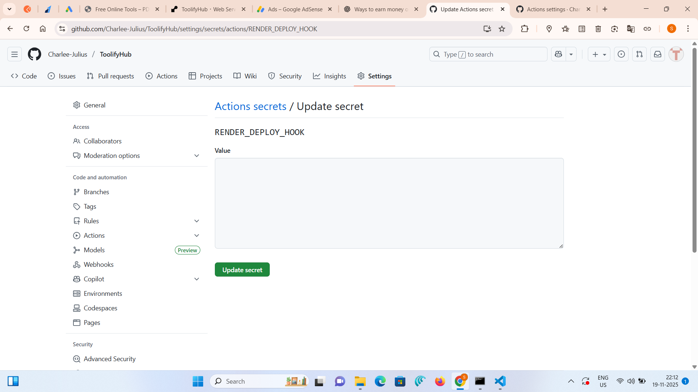

# 🛠️ ToolifyHub  
A modern collection of **free, fast, and mobile-friendly online tools** built using **Flask**.  
Includes PDF utilities, text tools, calculators, converters, image tools, QR tools, and more.

Live Website: **https://toolifyhub.onrender.com**

---
Auto deploy test #2

## 🚀 Features

### ✔ PDF Tools
- PDF Merge  
- PDF to Word  

### ✔ Image & File Tools  
- Image Compressor  
- QR Code Generator  
- YouTube Thumbnail Downloader  

### ✔ Calculators  
- BMI Calculator  
- GST Calculator  
- Age Calculator  

### ✔ Text Tools  
- Word & Character Counter  
- Text Summarizer  
- Password Generator  

### ✔ Converters  
- Unit Converter (km/m/cm)

---

## 📦 Technology Stack

- **Python 3**
- **Flask**
- **Jinja2 Templates**
- **HTML / CSS / JavaScript**
- **Pillow (PIL)**
- **PyPDF2**
- **python-docx**
- **qrcode**

Auto deploy test

---

## 🗂 Project Structure

